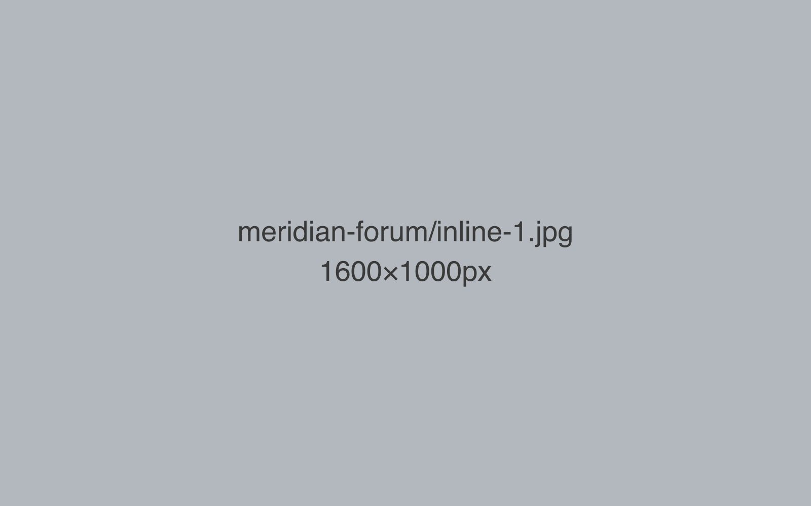
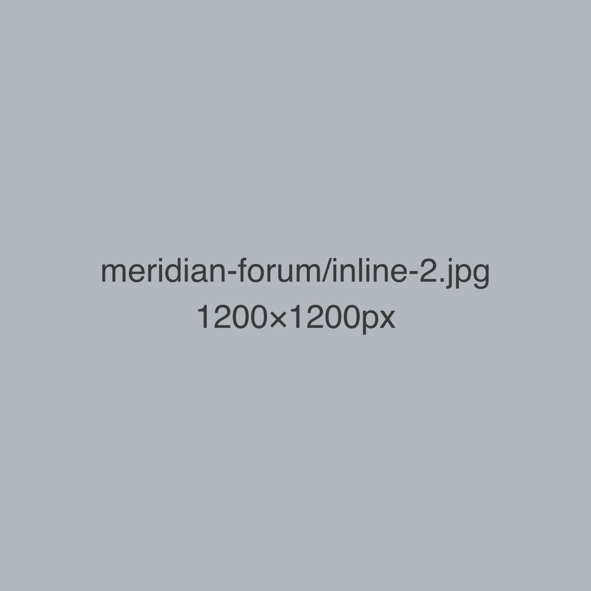
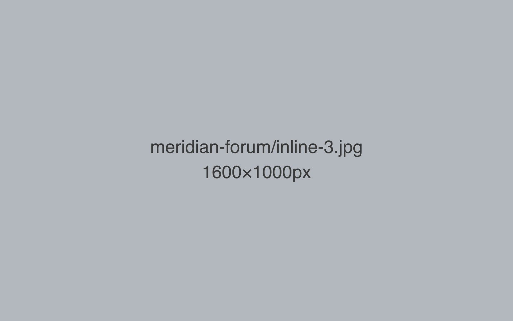

The Meridian Health Policy Forum runs every eighteen months with an external partner
institute, which meant two organisations' names, two review chains, and one deadline.
The job was to make the forum look and read as a single, confident event rather than
a compromise between two brand systems.

## Setting the shared visual language

Before any single asset got made, the two teams agreed on a short shared brief: one
accent colour drawn from each partner's palette, one typeface pairing, and a fixed
lock-up for how both names appeared together. That one page of agreement did more
work than any individual design decision — every later asset could be checked against
it without a fresh round of approvals each time.

## Outreach and registration

Outreach ran in three waves — save-the-date, full programme release, and a final
reminder for the still-undecided — each with its own short-form copy tailored to a
different level of commitment. The registration page was rebuilt as a single scroll
with the programme, speaker list, and practical details in one place, rather than
split across several linked pages that visitors kept abandoning midway.

## During and after

On-site, the job shifted to live coverage: same-day recap posts, photography
turnaround same evening rather than the following week, and a short highlights reel
cut for LinkedIn within 48 hours of the forum closing. Post-event, a written summary
went to both partner mailing lists, framed around what delegates actually asked in the
Q&A sessions rather than a generic thank-you.

## What made the difference

The forum's attendance and registration numbers moved in the right direction, but the
more durable outcome was procedural: the shared one-page brief became the template
the two partner teams now reach for automatically whenever they run something jointly,
without re-litigating the basics each time.
