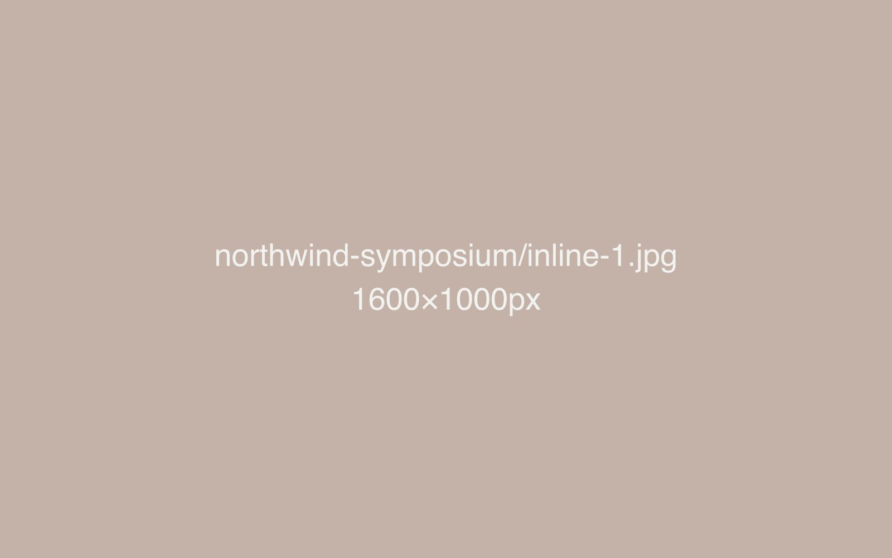
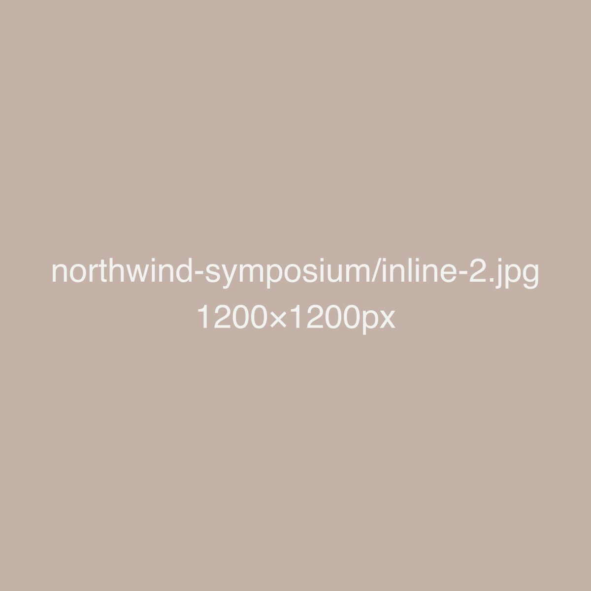
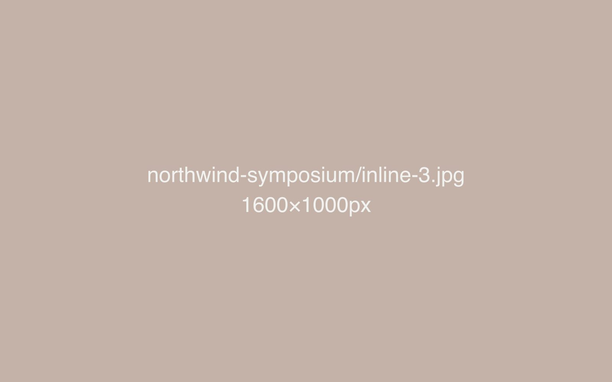
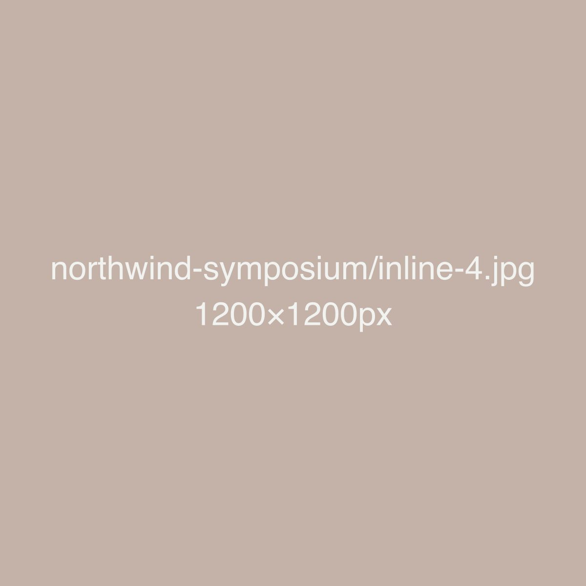
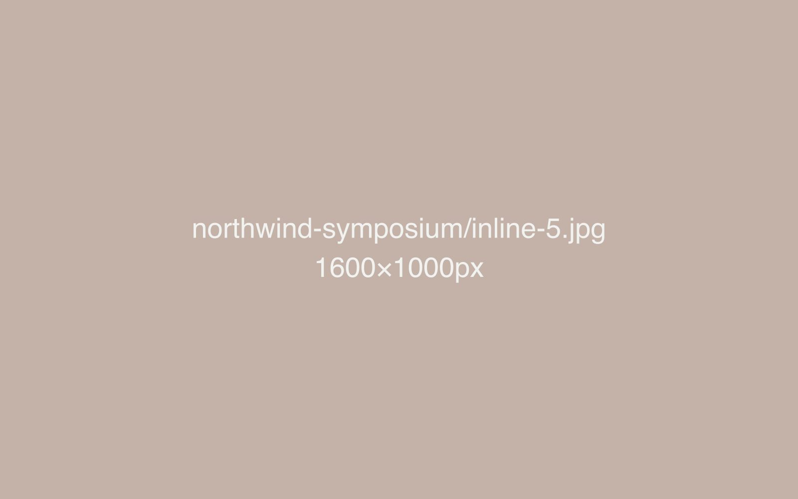

The Northwind Global Regulatory Symposium is the largest fixed point on the annual
calendar — the one event where the volume of moving parts makes or breaks the whole
quarter. This write-up covers a full cycle: audience outreach, collateral production,
live coverage, and the reporting that fed into planning the next edition.

## Starting from the calendar, not the brand

Most event marketing advice starts with the brand system. For a symposium with this
many touchpoints, it works better to start with the calendar and let the brand system
follow from it. Outreach, collateral, and content were mapped against a single
production timeline eleven weeks out, with every asset's deadline set by when it was
actually needed on-site or online — not by an arbitrary internal milestone.

That timeline surfaced the real bottleneck early: signage and print collateral, which
depend on a vendor with a two-week turnaround, needed final content locked well before
the programme itself was finalised. Once that was visible, the programme committee
agreed to a hard content freeze a week earlier than they'd planned, which turned what
had been a recurring last-minute scramble into a non-event.

## A collateral system, not eleven separate items

Eleven collateral pieces — flyers, banners, signage, decks, the programme booklet,
certificates, badges, a step-and-repeat backdrop, digital tickets, a delegate pack
insert, and a post-event thank-you card — went out under one visual system built from
three components: a fixed cover treatment, a consistent way of presenting speaker
names and titles, and one accent colour used identically everywhere it appeared.

> "You stop noticing the collateral is even there, which is exactly the point — nobody
> should be thinking about the signage when they should be thinking about the panel."

That restraint meant new pieces could be added late — a sponsor acknowledgment card,
added ten days out — without derailing the system, because there were only three
decisions to make consistently, not eleven fresh ones.

## Outreach across three audiences

Outreach split into three distinct pushes: returning delegates (a short, direct
renewal message, sent early), first-time prospects sourced from the mailing list (a
longer message establishing why the symposium mattered to someone unfamiliar with it),
and a targeted push to international regulatory bodies to widen the geographic spread
that the symposium is judged on year over year. Each got different copy, timing, and,
for the international push, translated summaries of the programme's most relevant
sessions.

## Live coverage without a dedicated crew

With no dedicated video or photography crew, live coverage relied on a simple rule:
one photo and one short clip captured after every session, uploaded to a shared folder
immediately, and a same-day recap post drafted from whatever came in — rather than
waiting for a polished edit that would arrive after attention had moved on. A short
highlights reel, cut from that same-day material, went out within 48 hours of closing.

## Reporting that actually changes the next edition

Post-event reporting deliberately avoided being a vanity summary. The report to the
programme committee led with three things: which outreach message drove the most
registrations, which sessions generated the most on-site engagement, and which
collateral piece needed the most last-minute rework — with a specific recommendation
attached to each. That last category is why the content freeze moved a week earlier
for this edition, and why it's likely to move earlier again next year.

## Results

| Metric | Sample value |
|---|---|
| Attendees | 412 |
| Countries represented | 22 |
| Registration growth vs. prior year | 31% |
| Collateral pieces produced | 11 |
| Combined social impressions | 16,400 |
| Newsletter subscriber growth | +740 |

None of these numbers are the point on their own — they matter because each ties back
to a specific decision (the earlier content freeze, the three-audience outreach split,
the same-day recap rule) that's now written into how the symposium gets planned, not
just how it got covered this one year.
